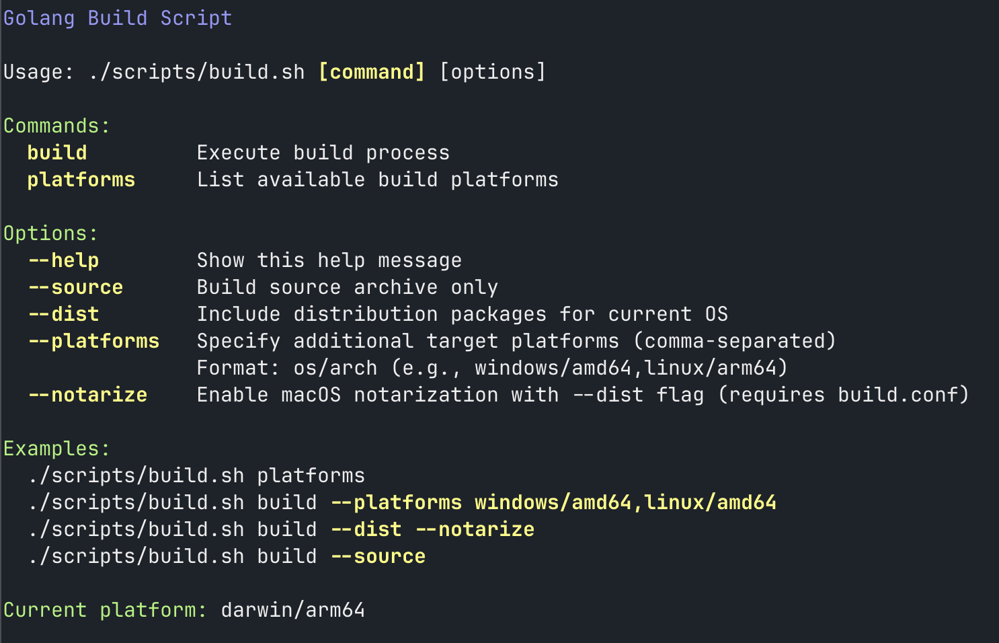
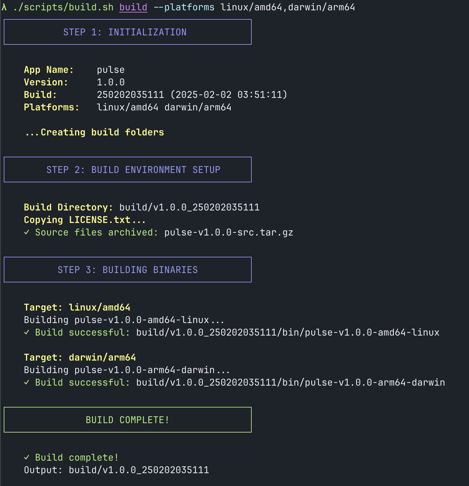
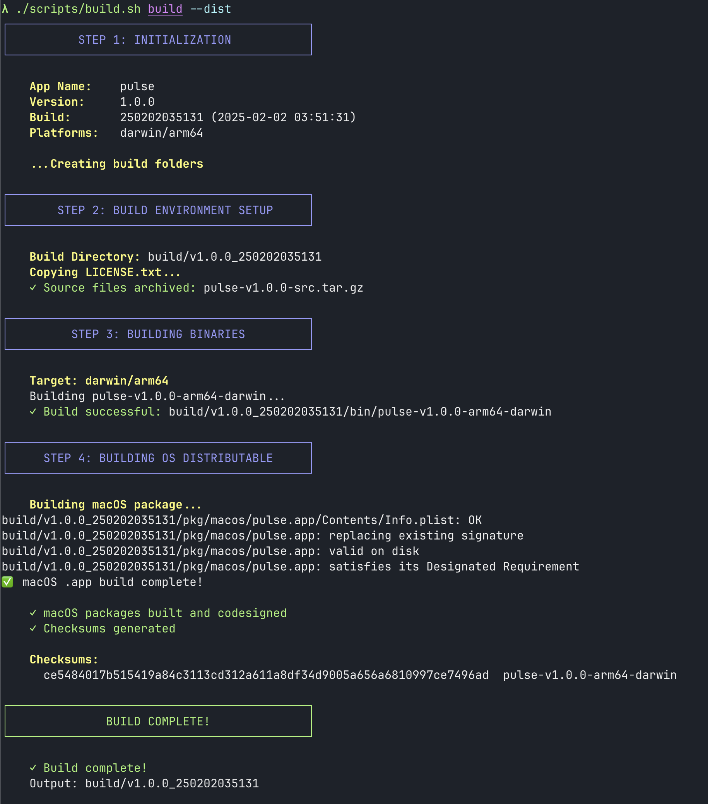

# golang-build

Golang build script in shell script to create coherent binaries and cross-platform packages.




## Use/Installation
Copy the scripts to your golang project, add a `LICENSE.txt` and define variables variables in `build.conf`.

## Status
Currently in development. Regular build commands should work cross-platform. 

Distributable only been tested on MacOS so far which is verified to work. Need to be tested and troubleshot on Windows and Linux.


## Screenshots

|||
|-|-|


## Examples

### Default build command
Generate source code archive and build (go build) for current platform
```bash
./scripts/build.sh build

# output
build/v1.0.0_250202035351
├── LICENSE.txt
├── bin
│   └── pulse-v1.0.0-arm64-darwin
└── src
    └── pulse-v1.0.0-src.tar.gz
```


## Build a source package
```bash
./scripts/build.sh build --source

# tree output
build/v1.0.0_250202035145
├── LICENSE.txt
└── pulse-v1.0.0-src.tar.gz
```


## Build multi-platform executables
```bash
./scripts/build.sh build --platforms linux/amd64,darwin/arm64

# tree output
build/v1.0.0_250202035111
├── LICENSE.txt
├── bin
│   ├── pulse-v1.0.0-amd64-linux
│   └── pulse-v1.0.0-arm64-darwin
└── src
    └── pulse-v1.0.0-src.tar.gz
```


## Build distributable packages
Build binary and packaged distributable for the current OS. (In this case MacOS)

```bash
./scripts/build.sh build --dist

# tree output
build/v1.0.0_250202035131
├── LICENSE.txt
├── bin
│   ├── checksums.txt
│   └── pulse-v1.0.0-arm64-darwin
├── pkg
│   └── macos
│       └── pulse.app
└── src
    └── pulse-v1.0.0-src.tar.gz
```